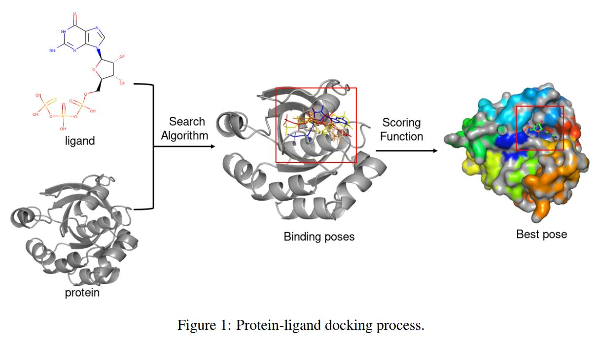
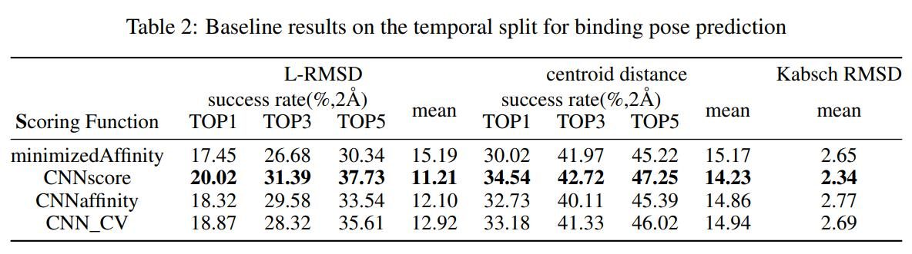
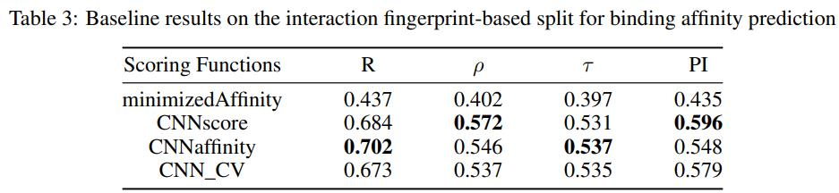
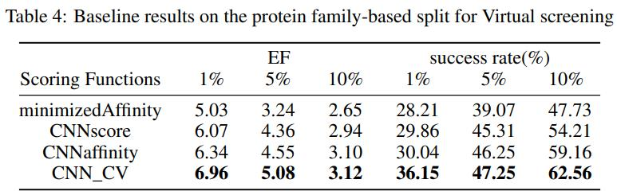

## Neural Protein Ligand Docking: Dataset and Evaluation
### PLDock

### Project Description
Machine learning is being utilized more and more to speed up and empower drug design and discovery. Recently, machine learning models have played a key role in structure-based virtual screening, assisting in the analysis of protein-ligand interactions and the prediction of binding affinity levels more rapidly and correctly, a process known as protein-ligand docking. Existing datasets, such as PDBbind, allow for the training and evaluation of classical protein-ligand docking approaches, but they lack specialized facilities for machine learning models, such as large amounts of data, rich features, and structured data splits for evaluating generalization capabilities.

In this work, we introduce a comprehensive neural protein-ligand docking dataset, called PLDock, and accompany it with a tool for training and evaluating machine learning-based protein-ligand docking models. We designed real scenario-based protein-ligand docking tasks, splits, baselines and metrics, with the goal of training and evaluating machine learning-based protein-ligand docking models. Currently, PLDock provides more than 70,000 protein-ligand complex structures, more than 150,000 protein-ligand affinity data, 3 typical tasks, 5 types of structured data splits and 9 evaluation metrics. For ease of use, all data and scripts are displayed in a commonly used format and are freely available online.
### Motivation
PLDock was developed to address the following concerns about machine learning protein-ligand docking models:
* To train and assess machine learning molecular docking models, a lot of data is needed.
* The sample attributes may need to be extracted as input by the docking model of machine learning.
* Molecular docking models must be adapted to different tasks such as virtual screening and binding affinity prediction.
* The docking model should be capable of generalization, which means it must be able to predict samples from various distributions from the training.
### Features

To be suitable for training and evaluation of machine learning docking models, we decided to acquire and expose many important features of PLDock’s samples. These features were carefully selected based on our research experience and biochemical domain knowledge of protein-ligand docking. The approach adopted here to obtain features is downloading from the database and software calculation. Table 1 summarizes the types, sources, and brief introductions of these features.

### Splits
In reality, we rely on old data training models to predict new data, such as training docking models with samples of existing targets to screen drugs of newly discovered targets, which can be seemed to predict on out-of-distribution (OOD) data of training set. To mimic real-world application scenarios, we use various structured data splits such as temporal split to assess the model’s generalization capabilities.
* Temporal split. According to the release time of crystal structure, the data is separated into
training, validation, and test sets, in order from early to late.
* Structure based split.
  * Ligand structure-based split. The split based on ligand structure is mainly based on the results of butina clustering clustering according to the tanamoto similarity of 2048-bit ECFP4 fingerprints of small molecules.
  * Protein family-based split. Protein based division adopts EC number-based split by default.
* Interaction-based split. The protein-ligand interaction fingerprint-based split is based on the 2048-bits protein–ligand extended connectivity (PLEC) interaction fingerprint. We split the data using a heuristic strategy employed in MoleculeNet based on fingerprint similarity to guarantee that the interactions between the training, validation, and test sets are as dissimilar as feasible.As far as we know, we are the first to propose dividing docking data sets according to interaction.
* Random split.
### Experimental Baseline Evaluation
To assess the utility of PLDock dataset, we evaluated one of the latest machine learning-based proteinligand docking methods, GNINA, on the below three tasks.
* Binding pose prediction.

* Binding affinity prediction.

* Virtual screening.

### Code & Data

- Code: [github](https://github.com/anonyanony0/PLDock)

- Data: [GoogleDrive](https://drive.google.com/drive/folders/1_WSo3_ceuSFPHK_hVrFtcXqK0C9LoGnQ)
